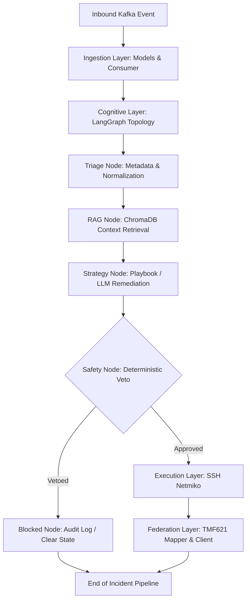

# TelcOS Lite

Level 3/4 Autonomous Operations Framework for Communication Service Providers (CSPs).

TelcOS Lite is a modular, production-ready framework designed to automate network-fault remediation, telemetry ingestion, and ServiceNow integration (TM Forum TMF621 Trouble Ticket). The framework operates within a hard SLA budget of 30 seconds per incident, featuring deterministic safety checks to prevent destructive network actions.

---

## Architecture Overview

TelcOS Lite is designed following **Clean Architecture** and **SOLID** principles, organized into distinct logical layers:



### Module Breakdown

1. **Ingestion Layer (`src/ingestion/`)**
   - [models.py](file:///d:/_extra/TelcOS-lite/src/ingestion/models.py): Validated, immutable Pydantic V2 domain models representing telemetry alarms. Includes timezone-aware normalization and automatic calculation of the 30-second SLA deadline.
   - [kafka_consumer.py](file:///d:/_extra/TelcOS-lite/src/ingestion/kafka_consumer.py): Async consumer listening for telemetry events, with exponential backoff retries and dead-letter queue (DLQ) support for unparseable payloads.

2. **Cognitive Layer (`src/cognitive/`)**
   - [graph.py](file:///d:/_extra/TelcOS-lite/src/cognitive/graph.py): Wires the LangGraph workflow topology, conditional routing, and node executions.
   - [nodes.py](file:///d:/_extra/TelcOS-lite/src/cognitive/nodes.py): Implements individual workflow nodes (triage, RAG queries, strategy, safety gate check, blocked audit logger).
   - [state.py](file:///d:/_extra/TelcOS-lite/src/cognitive/state.py): Defines the shared `GraphState` TypedDict running through the DAG.
   - [vectorstore.py](file:///d:/_extra/TelcOS-lite/src/cognitive/vectorstore.py): Interfaces with ChromaDB to fetch historical incident logs and runbooks.

3. **Execution Layer (`src/execution/`)**
   - [ssh_automation.py](file:///d:/_extra/TelcOS-lite/src/execution/ssh_automation.py): Connects to remote network devices via SSH using Netmiko to execute the proposed remediation commands.

4. **Federation Layer (`src/federation/`)**
   - [mapper.py](file:///d:/_extra/TelcOS-lite/src/federation/mapper.py): Maps the LangGraph state into trouble-ticket payloads conforming to the TM Forum TMF621 Trouble Ticket specification.
   - [client.py](file:///d:/_extra/TelcOS-lite/src/federation/client.py): Async HTTP client that dispatches trouble tickets with exponential back-off retries and error policies.

---

## Test Suite

The test suite is built using `pytest` and covers core framework functionality, boundary conditions, and edge cases (e.g. malformed inputs, timeout retries).

### Test Coverage

1. **Model Validations ([test_models.py](file:///d:/_extra/TelcOS-lite/tests/test_models.py))**
   - Timezone verification: Rejects naive datetimes and normalizes ISO-8601 strings to UTC.
   - Derived SLA Expiration: Asserts that `sla_expiration` is exactly `telemetry_timestamp + 30 seconds`.
   - IP validations: Tests IPv4, IPv6, and malformed IP formatting rules.
   - Immutability: Confirms the `TelemetryEvent` model is frozen.

2. **Safety Gates ([test_safety.py](file:///d:/_extra/TelcOS-lite/tests/test_safety.py))**
   - Command Filtering: Vetoes commands matching blocked patterns (e.g. `reload`, `shutdown`, `erase`, `format`) at word boundaries.
   - Power Threshold Rules: Rejects operations if the device power level falls below the minimum safe threshold (20%), while handling missing or malformed values gracefully.

3. **LangGraph Routing & E2E Flow ([test_graph.py](file:///d:/_extra/TelcOS-lite/tests/test_graph.py))**
   - Pure Routing: Validates deterministic branching inside `_route_after_safety` for safe, unsafe, and missing/malformed verdicts (fail-closed posture).
   - Mocked Graph execution: Evaluates the compiled StateGraph's execution flow under simulated safe (fully executed to TMF621 creation) and unsafe (redirected to BLOCKED node) environments.

4. **TMF621 Federation ([test_tmf621.py](file:///d:/_extra/TelcOS-lite/tests/test_tmf621.py))**
   - Data Mapping: Validates standard trouble-ticket generation, status mappings, and severity rules.
   - Async Client: Asserts successful posting, immediate failures on 4xx errors, and exponential backoff retry cycles on 5xx or connection/transport failures.

---

## Running the Tests

To run the test suite, ensure your virtual environment is active and run `pytest`:

```bash
# 1. Activate virtual environment
# Windows (PowerShell)
.\telcvenv\Scripts\Activate.ps1
# Linux / macOS
source telcvenv/bin/activate

# 2. Run the test suite
pytest -v tests/
```

### Mocking Strategy (No Visual C++ Requirements)

Because compiling compiled libraries like `chromadb` (which depends on C++ hnswlib) requires system compilers that may not be available in target environments, the test suite uses `tests/conftest.py` to globally stub heavy dependencies (`chromadb`, `netmiko`, `aiokafka`) in `sys.modules`.

Furthermore, it dynamically injects the `_node_state` tracking key into the `GraphState` TypedDict schema annotations at test runtime, allowing the tests to run the full compiled LangGraph workflow dynamically.

---

## Running the Program

The framework can be executed either entirely containerized using Docker Compose, or as a hybrid configuration where dependencies run in Docker and the FastAPI application runs locally.

### 1. Fully Containerized Execution (Recommended)

To spin up all services—including Kafka, ChromaDB, Zookeeper, a Mock SSH device, and the TelcOS Lite FastAPI app:

```bash
# Build and launch all services in detached mode
docker compose up --build -d
```

This exposes the following endpoints on your host system:
* **TelcOS Lite API / Health Check**: `http://localhost:8000/health`
* **Swagger API Documentation**: `http://localhost:8000/docs`
* **WebSocket Demo State Stream**: `ws://localhost:8000/api/v1/demo/stream`
* **ChromaDB Web API**: `http://localhost:8001`
* **Mock SSH Server (Netmiko Target)**: `localhost:2222` (Credentials: `admin`/`telcos123`)
* **Apache Kafka Broker**: `localhost:9092`

To shut down all containers and clean up volumes:
```bash
docker compose down -v
```

### 2. Local Development Execution (Hybrid Mode)

If you are developing local code modifications, you can run the backing infrastructure in Docker while executing the FastAPI application locally:

```bash
# 1. Start only the supporting dependencies
docker compose up -d zookeeper kafka chromadb mock_ssh_device

# 2. Activate your virtual environment and run the FastAPI app
.\telcvenv\Scripts\Activate.ps1
python -m src.main
```

Ensure your environment variables are configured correctly in a `.env` file at the root:
```env
APP_ENV=development
LOG_LEVEL=DEBUG
KAFKA_BOOTSTRAP_SERVERS=localhost:9092
CHROMA_HOST=localhost
CHROMA_PORT=8001
SSH_DEVICE_HOST=localhost
SSH_DEVICE_PORT=2222
SSH_DEVICE_USER=admin
SSH_DEVICE_PASSWORD=telcos123
```